# Reynj

[](https://github.com/reynj/reynj/actions/workflows/build.yml)
[](https://www.nuget.org/packages/Reynj)

### What is Reynj?

.Net Library that aids in comparison and handling value ranges or time bounded periods. Other names for a Range are Interval, Sequence, Period, Span, ... 

This implementation is based on the [Range](https://martinfowler.com/eaaDev/Range.html "Martin Fowler Range") class as described by Martin Fowler.

The aim of this library is to provide a base Range class with all possible methods that can be performed on a Range, but also extension methods that can be used to handle and compare lists of Ranges.
Below is my list of features I want to implement, feel free to open an issue if something is missing on my list.

<details>
  <summary>Click to expand the list</summary>

    - [ ] Range
      - [ ] Boundaries
      - [ ] Implicit Index & Range support, see [Adding Index and Range support to existing library types](https://docs.microsoft.com/en-us/dotnet/csharp/language-reference/proposals/csharp-8.0/ranges#adding-index-and-range-support-to-existing-library-types)
      - [ ] Type of Range should IComparable or IComparable<T> 
      - [x] Implements
        - [x] IEquatable
	    - [x] IComparable
	    - [x] ICloneable
        - [ ] IEnumerable ??
      - [x] Operators
         - [x] Equals
	     - [x] CompareTo
	     - [x] Convert to/from Tuple
      - [ ] Methods
        - [x] IsNullOrEmpty
        - [x] Includes & IncludesAll
	    - [x] Overlaps
	    - [x] Touches
        - [x] Gap
        - [x] Merge (Union)
	    - [x] Split
        - [x] Intersection
	    - [x] Exclusive
	    - [ ] EnumerateBy
           - [x] Ascending (protected)
           - [ ] Descending (protected)
           - [ ] EnumerateBy without stepper function (via dynamic or Expressions) (public)
	    - [ ] Expand (change the end)
        - [ ] Move (change the start and keep the gap between the end the same)
        - [ ] CenterValue (get the value in the middle between start and end)
      - [ ] Specific implemenations 
        - [ ] DateRange or Period
           - [ ] EnumerateBy
        - [ ] TimeRange
           - [ ] EnumerateBy
        - [ ] NumericRange
           - [ ] EnumerateBy
    - [ ] Collection of Ranges
      - [ ] Methods
        - [x] Lowest/Highest
	    - [x] IsContiguous
        - [ ] ToRange (only possible for a Contiguous collection)
        - [x] IsSingle
	    - [x] Reduce
        - [x] Sort
	    - [x] Union
	    - [x] Intersect
        - [x] Inverse
	    - [ ] Difference (Relative complement)
	    - [ ] Exclusive
        - [ ] Enumerate (call EnumerateBy on all ranges)
        - [ ] ContainsOverlaps (if ranges in the collection overlap)
    - [ ] Serialize/Deserialize
      - [x] SerializableAttribute 
      - [x] JsonConvertor (System.Text.Json)
      - [x] JsonConvertor (Newtonsoft Json.NET)
      - [ ] Entity Framework ValueConvertor
      - [ ] NHibernate IUserType
    - [x] Other
      - [x] Range<T>.Empty and methods like Merge, Overlaps, Touches, ...
      - [x] IsEmpty method vs Range<T>.Empty
      - [x] Support for conversion between System.Range (C# 8.0) and Range<int>
</details>


### Where can I get it?

You can install [Reynj with NuGet](https://www.nuget.org/packages/Reynj):

    Install-Package Reynj
    
Or via the .NET Core command line interface:

    dotnet add package Reynj

Either commands, from Package Manager Console or .NET Core CLI, will download and install Reynj and all required dependencies.

### How to use it?
#### What is a Range?
A Range is best visualized as a bar. It has a start and an end and contains everything between those two. Below is a visualization of Range of integers that start at 0 and end at 10. All whole numbers between 0 and 10 are included in the Range, except 10.

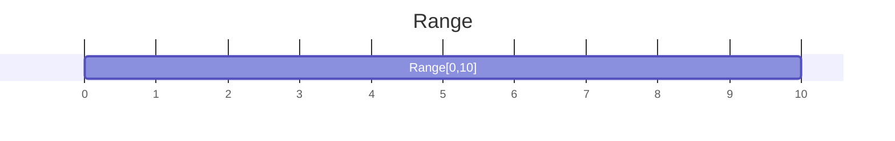

To create this Range in code, you can do the following:

```c#
var range = new Range<int>(0, 10);
```

There is only one limitation, the start of Range must be lower or equal to the end.

#### What are the types of Ranges that can be created?
The type of Range must derive from the [IComparable<T>](https://docs.microsoft.com/en-us/dotnet/api/system.icomparable-1?view=netcore-2.2) interface. Below some common examples.
  
```c#
// Numeric Ranges
var intRange = new Range<int>(0, 10);
var doubleRange = new Range<double>(0.0, 0.5);

// Date and Time Ranges
var dateRange = new Range<DateTime>(new DateTime(2018, 12, 18), new DateTime(2018, 12, 25)); // Period
var timeSpanRange = new Range<TimeSpan>(TimeSpan.FromHours(0), TimeSpan.FromHours(6)); // Duration
```

#### What is an Empty Range?
Every Range where start and end are equal.

```c#
var range1 = new Range<int>(10, 10);
var range2 = new Range<int>(0, 0);
var range3 = Range<int>.Empty;

// Empty
var equals = range1.Equals(range2); // returns true
var equals = range2.Equals(range3); // returns true
var compare = range1.CompareTo(range3); // returns 0
```

#### What can be done with a Range?
##### Determining equality
Because Range<T> implements the [IEquatable<T>](https://docs.microsoft.com/en-us/dotnet/api/system.iequatable-1?view=netcore-2.2) interface, including the operators the following can be done:
  
```c#
var range1 = new Range<int>(0, 10);
var range2 = new Range<int>(0, 10);
var range3 = new Range<int>(5, 9);

// Equals
var res1 = range1.Equals(range2); // returns true
var res2 = range1.Equals(range3); // returns false

// Equality Operators
var res3 = range1 == range2; // returns true
var res4 = range1 != range2; // returns false
var res5 = range1 == range3; // returns false
var res6 = range1 != range3; // returns true
```

##### Ordering or Sorting
Because Range<T> implements the [IComparable<T>](https://docs.microsoft.com/en-us/dotnet/api/system.icomparable-1?view=netcore-2.2) interface, including the operators the following can be done:
  
```c#
var range1 = new Range<int>(0, 10);
var range2 = new Range<int>(5, 9);

// CompareTo
var res1 = range1.CompareTo(range2); // returns -1

// Equality Operators
var res2 = range1 < range2;  // returns true
var res3 = range1 > range2;  // returns false
var res4 = range1 <= range2; // returns true
var res5 = range1 >= range2; // returns false
```

##### Tuples
A Range<T> has two primary properties, Start and End, because of that a Range<T> can also be represented as a Tuple, in the lastest versions of .Net as a [ValueTuple](https://docs.microsoft.com/en-us/dotnet/api/system.valuetuple?view=netcore-2.2).
The constructor of a Range<T> accepts a Tuple of two elements and there is an AsTuple method to convert a Range<T> to a ValueTuple<T, T>.
Conversion operators have been implemented to make this even more smoothly.

```c#
var tuple = (0, 10);
var range = new Range<int>(tuple);

// AsTuple
var otherTuple = range.AsTuple();

// Conversion Operators
var otherTuple2 = range; // implicit from Range to Tuple
var otherRange = (Range<int>) tuple; // explicit from Tuple to Range
```

##### Methods
###### Includes(T value), Includes(Range<T> range) and IncludesAll(IEnumerable<T> values)
Includes will return true if the given value is a part of the Range, otherwise false.
IncludesAll will return true if all of the given values are part of the Range, otherwise false.

```c#
var range = new Range<int>(0, 10);

// Includes(T value)
var res1 = range1.Includes(5); // returns true
var res2 = range1.Includes(20); // returns false

// Includes(Range<T> range)
var res1 = range1.Includes(new Range<int>(2, 7)); // returns true
var res2 = range1.Includes(new Range<int>(20, 30)); // returns false

// IncludesAll
var res3 = range1.IncludesAll(0, 1, 2, 3, 4, 5, 6, 7, 8, 9); // returns true
var res4 = range1.IncludesAll(0, 1, 2, 3, 4, 20, 6, 7, 8, 9); // returns false
```

###### Overlaps(Range<T> range)
Overlaps will return true if two Ranges overlap. The following example are two overlapping ranges.

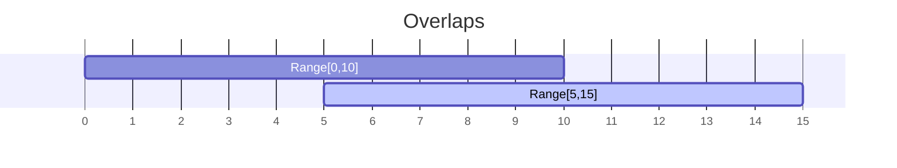

```c#
var range1 = new Range<int>(0, 10);
var range2 = new Range<int>(5, 15);
var range3 = new Range<int>(15, 25);

// Overlaps
var res1 = range1.Overlaps(range2); // returns true
var res2 = range2.Overlaps(range1); // returns true

var res3 = range1.Overlaps(range3); // returns false
```

###### Touches(Range<T> range)
Touches will return true if two Ranges touch each other. The following example are two touching ranges.

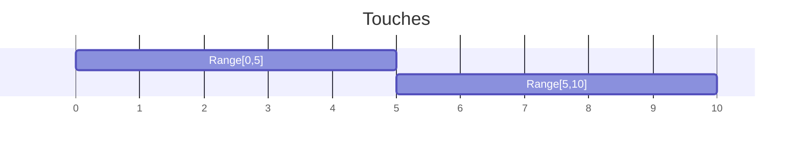

```c#
var range1 = new Range<int>(0, 10);
var range2 = new Range<int>(10, 20);
var range3 = new Range<int>(11, 20);

// Overlaps
var res1 = range1.Touches(range2); // returns true
var res2 = range2.Touches(range1); // returns true

var res3 = range1.Touches(range3); // returns false
```

###### Gap(Range<T> range)
Gap returns a new Range that represents the gap between two Ranges.

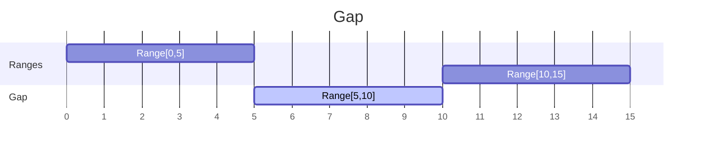

```c#
var range1 = new Range<int>(0, 10);
var range2 = new Range<int>(15, 20);

// Gap
var gap1 = range1.Gap(range2); // returns new Range<int>(5, 10)
var gap2 = range2.Gap(range1); // returns new Range<int>(5, 10)
```

###### Merge(Range<T> range)
Merge returns a new Range that represents the combined/merged Range, a [Logical disjunction](https://en.wikipedia.org/wiki/Logical_disjunction).
An exception is thrown when the ranges do not overlap or touch each other.

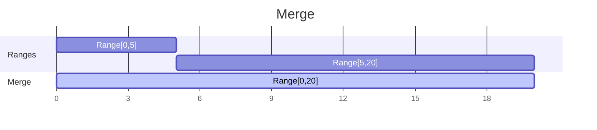

```c#
var range1 = new Range<int>(0, 10);
var range2 = new Range<int>(5, 20);

// Merge
var merge1 = range1.Merge(range2); // returns new Range<int>(0, 20)
var merge2 = range1 | range2; // returns new Range<int>(0, 20)
```

###### Split(Range<T> range)
Split returns a Tuple of two Ranges that have been split on the given value.
An exception is thrown when the value is not included in the Range.

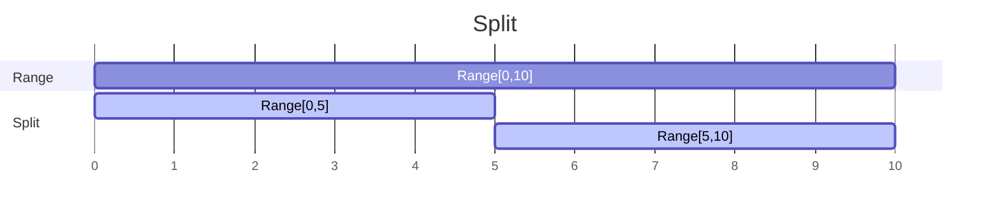

```c#
var range = new Range<int>(0, 10);

// Split
var split = range.Split(5); // returns (new Range<int>(0, 5), new Range<int>(5, 10))
```

###### Intersection(Range<T> range)
Intersection returns a new Range that represents the intersection between the current Range and a given Range, a [Logical conjunction](https://en.wikipedia.org/wiki/Logical_conjunction).
An exception is thrown when the ranges do not overlap each other.

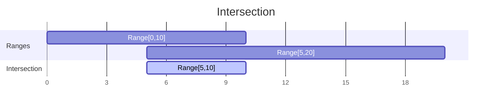

```c#
var range1 = new Range<int>(0, 10);
var range2 = new Range<int>(5, 20);

// Intersection
var intersection1 = range1.Intersection(range2); // returns new Range<int>(5, 10)
var intersection2 = range1 & range2; // returns new Range<int>(5, 10)
```

###### Exclusive(Range<T> range)
Exclusive returns a tuple of Ranges that that represent the parts they do not have in common, an [Exclusive or](https://en.wikipedia.org/wiki/Exclusive_or).
An exception is thrown when the ranges are null or Empty.

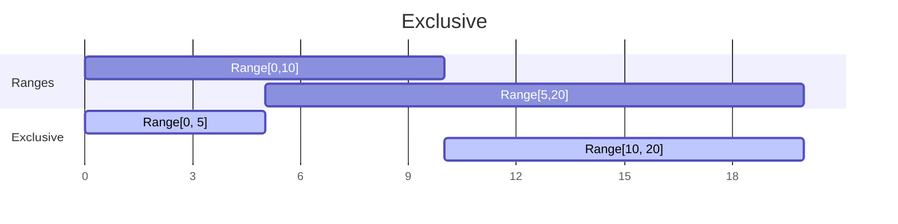

```c#
var range1 = new Range<int>(0, 10);
var range2 = new Range<int>(5, 20);

// Exclusive
var exclusive = range1.Exlusive(range2); // returns (new Range<int>(0, 5), new Range<int>(10, 20))
```

###### IsEmpty()
IsEmpty will return true if the start and the end of the Range are equal, otherwise false.

```c#
var range1 = new Range<int>(0, 10);
var range2 = new Range<int>(10, 10);

// IsEmpty
var res1 = range1.IsEmpty(); // returns false
var res2 = range2.IsEmpty(); // returns true
```

###### EnumerateBy(T step, Func<T, T, T> stepper) & EnumerateBy(TStep step, Func<T, TStep, T> stepper)
EnumerateBy returns all values between start and end of the Range, given a step and stepper function. 
The stepper function should always return a value higher than the previous call. There is an overload that allows the step to be of a different type than the typeof start and end of the Range.
This function is protected and should be used in class that inherits from Range<T>.

```c#
// EnumerateBy(T step, Func<T, T, T> stepper)
var range = new Range<int>(0, 10);

var values = range.EnumerateBy(2, (value, step) => value + step); // returns 0, 2, 4, 6, 8

// EnumerateBy(TStep step, Func<T, TStep, T> stepper)
var startDate = new DateTimeOffset(2020, 8, 1, 8, 0, 0, TimeSpan.FromHours(2));
var endDate = new DateTimeOffset(2020, 8, 1, 14, 0, 0, TimeSpan.FromHours(2));
var range = new Range<DateTimeOffset>(startDate, endDate);

var values = range.EnumerateBy(TimeSpan.FromHours(2), (value, step) => value.Add(step)); // returns 2020-08-01 08:00, 2020-08-01 10:00, 2020-08-01 12:00
```

##### Extension Methods
###### ToRange()
With the ToRange extension methods on both Range<int> and System.Range a conversion can be done between them.
A System.Range and a Reynj.Range have not so much in common, a [System.Range](https://docs.microsoft.com/en-us/dotnet/csharp/whats-new/csharp-8#indices-and-ranges) is meant for accessing single elements or ranges in a sequence,
but by converting from them to a Range<int> it is possible to use all methods on Range<int> and Enumerable<Range<int>>.


```c#
var range = new Range<int>(0, 10);

// ToRange()
var sysRange = range.ToRange(); // returns new System.Range(0, 10)

// ToRange()
var reynjRange = sysRange.ToRange(); // returns new Range<int>(0, 10)
```

##### Additional Libraries
###### Reynj.Text.Json
Provides a converter, named `RangeConverter` for the System.Text.Json library.
Be aware that the type of Start and End also require a converter, either included in the System.Text.Json library or from another source.

```c#
var options = new JsonSerializerOptions { Converters = { new RangeConverter() } }; // Required

// Json Serialize
var range = new Range<int>(0, 10);
var jsonText = JsonSerializer.Serialize(range, options); // returns '{"Start":0,"End":10}'

// Json Deserialize
var jsonRange = JsonSerializer.Deserialize(jsonRange, range.GetType(), options); // returns new Range<int>(0, 10)
```

In your ASP.NET project you can add the following code to the Startup.cs to register the converter.

```c#
services.AddControllers()
    .AddJsonOptions(options =>
    {
        options.JsonSerializerOptions.Converters.Add(new RangeConverter());
        // ...
    });
```

###### Reynj.Newtonsoft.Json
Provides a converter, named `RangeConverter` for the Newtonsoft.Json library.
Be aware that the type of Start and End also require a converter, either included in the Newtonsoft.Json library or from another source.

```c#
var settings = new JsonSerializerSettings { Converters = { new RangeConverter() } }; // Required

// Json Serialize
var range = new Range<int>(0, 10);
var jsonText = JsonConvert.SerializeObject(range, settings); // returns '{"Start":0,"End":10}'

// Json Deserialize
var jsonRange = JsonConvert.DeserializeObject(json, typeOfRange, settings); // returns new Range<int>(0, 10)
```

In your ASP.NET project you can add the following code to the Startup.cs to register the converter.

```c#
services.AddControllers()
    .AddNewtonsoftJson(options =>
    {
        options.SerializerSettings.Converters.Add(new RangeConverter());
        // ...
    });
```

#### What is a Collection of Ranges?
A Collection of Ranges is a group or list of Ranges of the same type. 

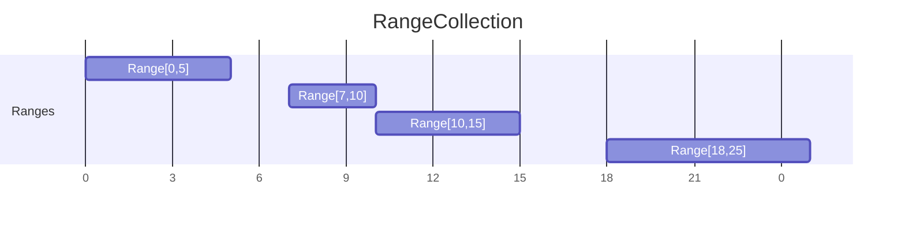

To create an IEnumerable<Range<T>> in code, you can do the following:

```c#
// Collection based on an IEnumerable<Range<T>>
var ranges = new List<Range<int>>() {
    new Range<int>(0, 10),
    new Range<int>(10, 20)
}
```

#### What can be done with a Collection of Ranges?

##### Extension Methods
###### Lowest() / Highest()
They return the lowest start or highest end of the all the Ranges in the collection.

```c#
var ranges = new List<Range<int>>
{
    new Range<int>(0, 10),
    new Range<int>(10, 20)
};

// Lowest
var lowest = ranges.Lowest(); // returns 0

// Highest
var highest = ranges.Highest(); // returns 20
```

###### Reduce()
Returns a new Collection of Ranges where all overlapping and touching Ranges have been merged and empty Ranges have been removed.

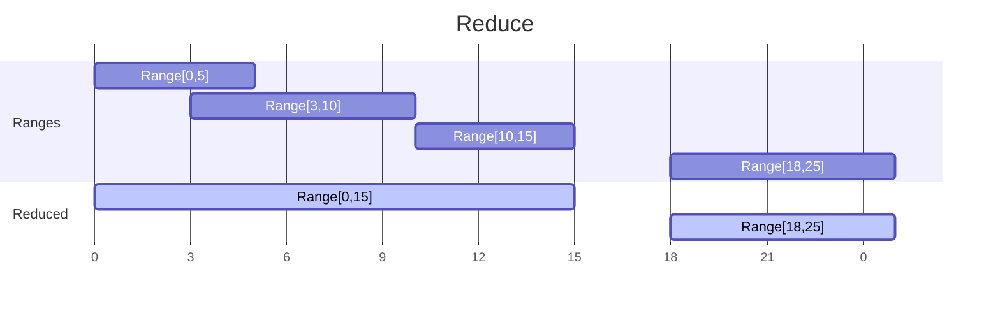

```c#
var ranges = new[]
{
    new Range<int>(0, 5),
    new Range<int>(3, 10),
    new Range<int>(10, 15),
    new Range<int>(18, 25)
});

// Reduce
var reduced = ranges.Reduce(); // returns new[] { new Range<int>(0, 15), new Range<int>(18, 25) }
```

###### Union()
Returns the [union](https://en.wikipedia.org/wiki/Union_(set_theory)) of two Collections of Ranges while reducing them.
An exception is thrown when one or both of the ranges are null.

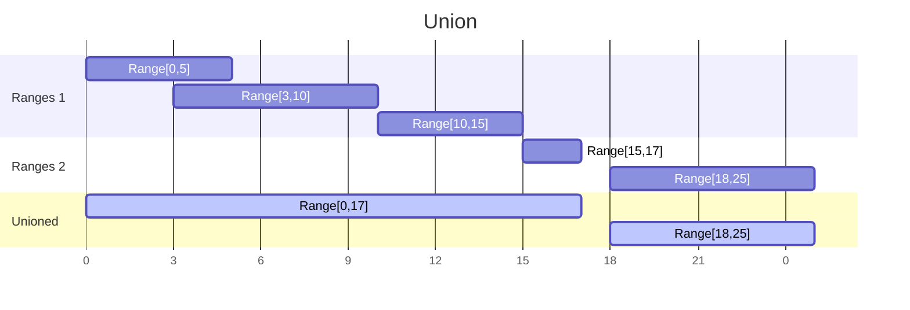

```c#
var ranges1 = new[]
{
    new Range<int>(0, 5),
    new Range<int>(3, 10),
    new Range<int>(10, 15)
});

var ranges2 = new[]
{
    new Range<int>(15, 17),
    new Range<int>(18, 25)
});

// Union
var unioned = ranges1.Union(ranges2); // returns new[] { new Range<int>(0, 17), new Range<int>(18, 25) }
```

###### Intersect()
Returns the [intersection](https://en.wikipedia.org/wiki/Intersection_(set_theory)) of two Collections of Ranges while reducing them.
An exception is thrown when one or both of the ranges are null.

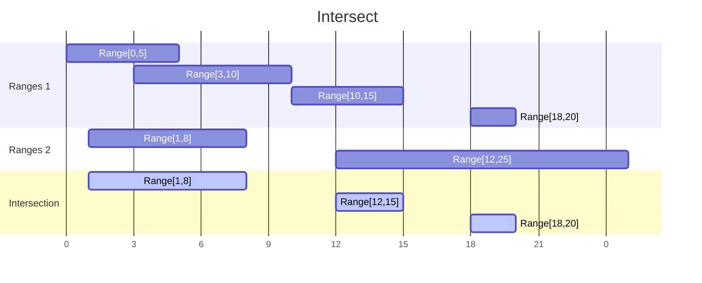

```c#
var ranges1 = new[]
{
    new Range<int>(0, 5),
    new Range<int>(3, 10),
    new Range<int>(10, 15),
    new Range<int>(18, 20)
});

var ranges2 = new[]
{
    new Range<int>(1, 8),
    new Range<int>(12, 25)
});

// Intersect
var intersection = ranges1.Intersect(ranges2); // returns new[] { new Range<int>(1, 8), new Range<int>(12, 15), new Range<int>(18, 20) }
```

<!--
###### Difference
Returns the set difference or [relative complement](https://en.wikipedia.org/wiki/Complement_(set_theory)#Relative_complement) of two Collections of Ranges while reducing them.
An exception is thrown when one or both of the ranges are null.

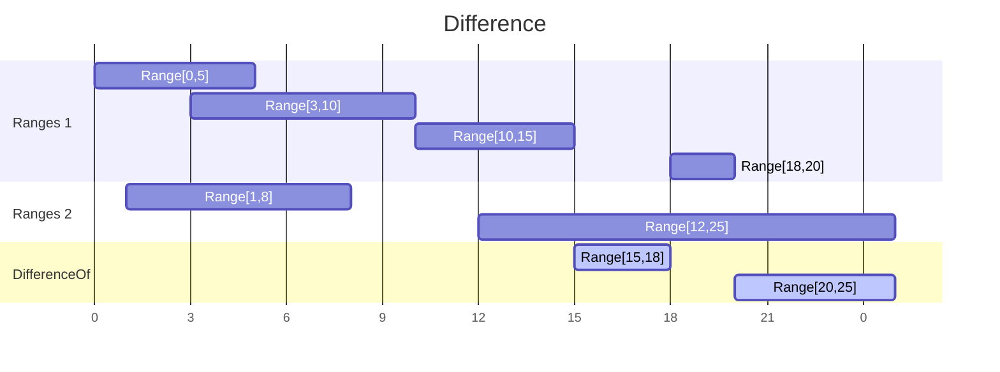

```c#
var ranges1 = new[]
{
    new Range<int>(0, 5),
    new Range<int>(3, 10),
    new Range<int>(10, 15),
    new Range<int>(18, 20)
});

var ranges2 = new[]
{
    new Range<int>(1, 8),
    new Range<int>(12, 25)
});

// Set Difference
var differenceOf = ranges1.Difference(ranges2); // returns new[] { new Range<int>(15, 18), new Range<int>(20, 25) }
```

###### Exclusive()
Returns the [exclusive or](https://en.wikipedia.org/wiki/Symmetric_difference) of two Collections of Ranges while reducing them.
An exception is thrown when one or both of the ranges are null.

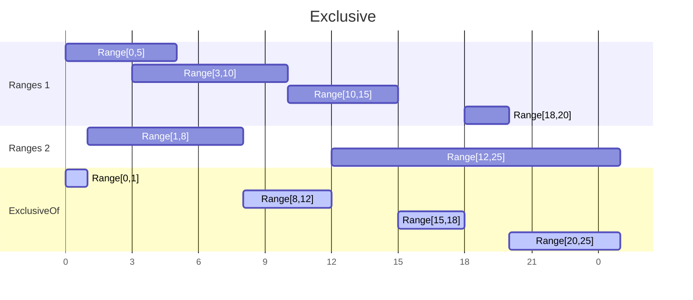

```c#
var ranges1 = new[]
{
    new Range<int>(0, 5),
    new Range<int>(3, 10),
    new Range<int>(10, 15),
    new Range<int>(18, 20)
});

var ranges2 = new[]
{
    new Range<int>(1, 8),
    new Range<int>(12, 25)
});

// Intersect
var exclusiveOr = ranges1.Exclusive(ranges2); // returns new[] { new Range<int>(0, 1), new Range<int>(8, 12), new Range<int>(15, 18), new Range<int>(20, 25) }
```
-->

###### Inverse()
Returns a new Collection of Ranges that is the inversion of the Ranges. Meaning all gaps between the ranges are returned including the gap between the minvalue and the first start and the last end and the maxvalue.
Also known as the [absolute complement](https://en.wikipedia.org/wiki/Complement_(set_theory)#Absolute_complement).
An exception is thrown when the type of Range has no MinValue and MaxValue or when they are not passed.

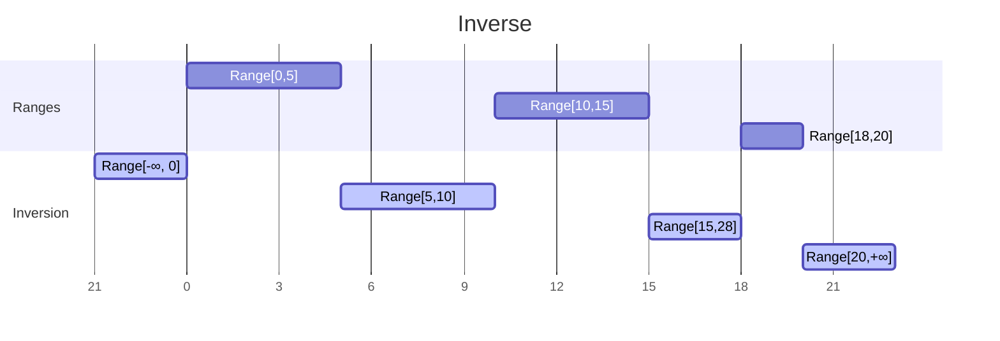

```c#
var ranges = new[]
{
    new Range<int>(0, 5),
    new Range<int>(10, 15),
    new Range<int>(18, 20)
});

// Inverse
var inversion = ranges.Inverse(); // returns new[] { new Range<int>(int.MinValue, 0), new Range<int>(5, 10), new Range<int>(15, 18), new Range<int>(20, int.MaxValue) }
```

###### IsContiguous()
Check if a collection of Ranges only contains touching Ranges and form a contiguous sequence.

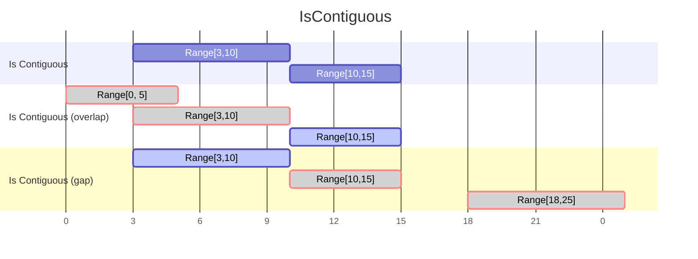

```c#
var contiguousRanges = new[]
{
    new Range<int>(10, 15),
    new Range<int>(18, 25)
});

var withOverlapRanges = new[]
{
    new Range<int>(0, 5),
    new Range<int>(3, 10),
    new Range<int>(10, 15)
});

var notTouchingRanges = new[]
{
    new Range<int>(3, 10),
    new Range<int>(10, 15),
    new Range<int>(18, 25)
});

// IsContiguous
var isContiguous1 = contiguousRanges.IsContiguous(); // returns true
var isContiguous2 = withOverlapRanges.IsContiguous(); // returns false
var isContiguous3 = notTouchingRanges.IsContiguous(); // returns false
```

###### IsSingle()
Helper method on IEnumerable that returns true if the sequence contains exacly one element.

```c#
var emptyList = new List<Range<int>>();

var singleItemList = new[]
{
    new Range<int>(0, 5)
});

var multiItemList = new[]
{
    new Range<int>(3, 10),
    new Range<int>(10, 15)
});

// IsSingle
var isSingle1 = emptyList.IsSingle(); // returns false
var isSingle2 = singleItemList.IsSingle(); // returns true
var isSingle3 = multiItemList.IsSingle(); // returns false
```